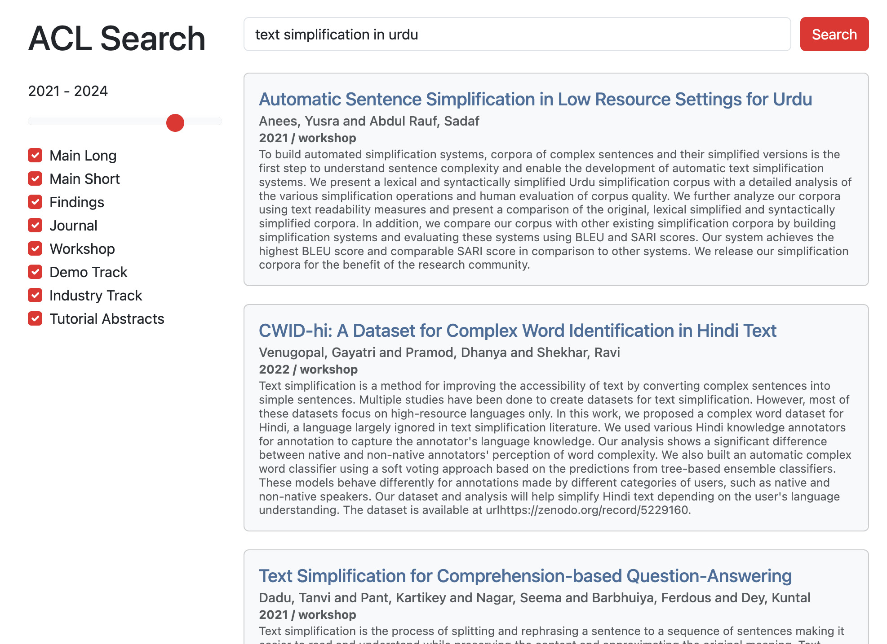

## ACL Search

Use ColBERT as a search engine for the [ACL Anthology](https://aclanthology.org/)  and [OpenReview conferences](https://openreview.net/), or any .bib file. Check out the [live demo](https://acl-search.fly.dev/).

<div align="center">
    
</div>

## Quick Setup

```sh
# (optional): conda install -y -n aclsearch python=3.10
git clone https://github.com/davidheineman/acl-search
pip install -r requirements.txt 
python src/server.py # (this will download a pre-built index!)

# (getting pip errors?)
sudo apt-get update
sudo apt-get install -y pkg-config libsentencepiece-dev
```

## More Features

**(Optional) Parse & Index the Anthology**

This step allows indexing the anthology manually. This can be skipped, since the parsed/indexed anthology will be downloaded from [huggingface.co/davidheineman/colbert-acl](https://huggingface.co/davidheineman/colbert-acl).

*You can also include you own papers by adding to the `anthology.bib` file!*

```sh
# pull from openreview
echo -e "[email]\n[password]" > .openreview
python src/scrape/openrev.py

# pull from acl anthology
python src/scrape/acl.py

# create unified dataset
python src/parse.py

# index with ColBERT 
# (note: sometimes there is a silent failure if the CPP extensions do not exist)
python src/index.py
```

**Deploy Web Server**
```sh
# Start an API endpoint
gunicorn -w 4 -b 0.0.0.0:8080 server:app

# Then visit:
# http://localhost:8080
# or use the API:
# http://localhost:8080/api/search?query=Information retrevial with BERT
```

**Deploy as a Docker App**
```sh
# Build and run locally
docker build . -t acl-search:main
docker run -p 8080:8080 acl-search:main

# Or pull the hosted container
docker pull ghcr.io/davidheineman/acl-search:main # add for macos: --platform linux/arm64 
docker run -p 8080:8080 ghcr.io/davidheineman/acl-search:main

# Lauch it as a web service!
brew install flyctl
fly launch
```

**Update Index on HF**
```sh
# For a full pipeline to update an index, see: src/scrape/beaker/index.sh

# Build and deploy container for auto-updating:
docker build -t acl-search -f src/scrape/beaker/Dockerfile .
docker run -it -e HF_TOKEN=$HF_TOKEN acl-search # (Optional) test it out!

# Run on slurm
sbatch src/scrape/slurm.sh

# Run on beaker
beaker image delete davidh/acl-search
beaker image create --name acl-search acl-search
beaker experiment create src/scrape/beaker/beaker-conf.yml
```

## Example notebooks

To see an example of search, visit:
[colab.research.google.com/drive/1-b90_8YSAK17KQ6C7nqKRYbCWEXQ9FGs](https://colab.research.google.com/drive/1-b90_8YSAK17KQ6C7nqKRYbCWEXQ9FGs?usp=sharing)

<!-- ## Notes
- See: 
    - https://github.com/stanford-futuredata/ColBERT/blob/main/colbert/index_updater.py
    - https://github.com/stanford-futuredata/ColBERT/issues/111

- To generate favicon:
    cd src/static
    inkscape favicon.svg --export-type=png --export-background-opacity=0 --export-filename=favicon.png
    convert favicon.png -resize 256x256 favicon.ico
    rm favicon.png

- TODO:
    - On UI
        - Add a "last scaped at time X" button, and a ? modal next to the years to explain why it only goes back to 2010
        - Have it auto-select the search when you load the page
        - Make the titles different colors depending on the venue / type
        - Make people's names clickable to their research website

        - Single click "copy" for bib key
        - Colors: make the colors resemble the ACL page much closer
            - There's still a bunch of blue from the bootstrap themeing
        - Smaller line spacing for abstract text
        - Justify the result metadata (Year, venue, etc.) so the content all starts at the same vertical position
        - Add a "Expand" button at the end of the abstract
        - Put two sliders on the year range (and make the years selectable, with the years at both ends of the bar)
        - If the user selects certain venues, remember these venues
        - Add a dropdown under the "Workshop" box to select specific workshops

    - On search quality
        - Only includes ICLR 2020-, NeurIPS 2020-, ICML 2023-. Fix this.
            - Add workshops (see `openreview_confs.json`)
        - Pre-2020 ACL papers still not correctly organized?
        - More papers here? https://github.com/mlresearch/mlresearch.github.io?tab=readme-ov-file

    - On indexing
        - Make indexing code better 
            (currently, the setup involves manually copying the CPP files becuase there is a silent failure, this also should be possible to do on Google Collab, or even MPS)
            - Fix "sanity check" in index.py
            - Investigate why it's so slow (~8 hours for 70K papers. I think faiss is the culprit)
        - Make this one-click re-indexing as a GitHub action (potentially when building the container? Or re-build the container when HF is updated)

    - On deployment
        - Reduce batch batch size to help RAM usage (https://fly.io/docs/about/pricing/#started-fly-machines)
        - Memory errors: In `load_test.py`, if we submit more than 5 requests simultaneously, it triggers an OOM error. We need the server to have a queue to elegantly handle simultanous queries so it never runs out of memory (also batch the inputs to handle multiple requests at once)
 -->